# Livrable 2 - Domaine

**Cairn - Système de gestion d’événements de randonnée (CAR-HMS)**

## 1. Page de couverture

| Information | Détail |
|---|---|
| Équipe | 2 |
| Projet | Cairn (CAR-HMS) |
| Date | 22 novembre 2026 |
| Cours | SEG 3502 |
| Professeur | Kalonji Kalala |
| Livrable | 2 - Domaine |
| Dépôt GitHub | [SEG3502Lab/SEG3502Lab-Projet_CAR-HMS](https://github.com/SEG3502Lab/SEG3502Lab-Projet_CAR-HMS) |

| Membre | GitHub | Numéro d’étudiant |
|---|---|---|
| Mehdi Semmar | [MehdiSmr](https://github.com/MehdiSmr) | 300372426 |
| Salma Sajid | [SjSalma](https://github.com/SjSalma) | 300370622 |

## 2. Sommaire exécutif

Destiné au professeur et aux correcteurs du cours SEG 3502, ce document présente la conception tactique du domaine de CAR-HMS : hypothèses, modèles UML des sous-domaines et réalisations des cas d’utilisation aux niveaux 1 et 2.

## 3. Description de l’équipe et des rôles

| Membre | Tâches effectuées pour ce livrable |
|---|---|
| Mehdi Semmar | Conception UML, implémentation du domaine, réalisation des cas d’utilisation et tests Cucumber pour une première moitié des fonctionnalités. Préparation de la structure du rapport Markdown. |
| Salma Sajid | Conception UML, implémentation du domaine, réalisation des cas d’utilisation et tests Cucumber pour l’autre moitié des fonctionnalités. Configuration du workflow GitHub Actions et finalisation du rapport Markdown. |

## 4. Hypothèses et décisions de conception

Les hypothèses et décisions de conception retenues par l’équipe sont les suivantes :

| **No** | **Hypothèse ou décision** | **Justification** |
|:---|----|----|
| H1 | Le niveau 1 montre la collaboration entre la réalisation du cas d’utilisation, les façades et les services applicatifs. Le niveau 2 détaille l’intérieur des façades : dépôts, fabriques, agrégats, services de domaine et événements. | Le gabarit du cours n’était pas accessible ; cette lecture applique le patron façade demandé. |
| H2 | SignUp est une entité interne de l’agrégat Hike. | La capacité, la promotion et les positions d’attente forment un seul invariant à protéger de façon atomique. |
| H3 | Les associations entre agrégats passent par des identifiants : HikerId, TrailId. | Conforme à l’énoncé ; chaque agrégat reste une frontière de cohérence. |
| H4 | La saison d’ouverture d’un sentier est annuelle (MonthDay). | Le contrat attend le refus « certification non valide » pour une sortie le 2028-05-15 sur un sentier dont la saison est donnée pour 2027. |
| H5 | Le point de départ d’un rappel est l’attribut trailhead du sentier. | CreateHikeQuery ne contient aucun point de départ. |
| H6 | Un rappel est dû lorsque le départ est dans plus de 0 heure et au plus 24 heures. | Le contrat fixe seulement le cas à 24 heures exactes et le refus à trois jours ; la fenêtre tolère un planificateur en retard. |
| H7 | Le rappel est marqué comme envoyé après l’envoi des courriels. Une panne du service météo n’empêche pas l’envoi. | Évite de marquer envoyé un rappel qui n’est pas parti. |
| H8 | Les agrégats accumulent leurs événements ; la façade les émet après la sauvegarde. | Aucun événement n’est publié pour un changement refusé. |
| H9 | L’utilisateur connecté est fourni par CurrentUserService. Un administrateur est un UserAccount et n’est pas forcément un Hiker. | Les requêtes ne transportent qu’un courriel ; le contrat distingue visiteur, autre utilisateur et administrateur. |
| H10 | L’acteur d’une transition est une chaîne : le courriel de l’utilisateur ou « système ». | Les contrats vérifient ces valeurs, et le système n’a pas d’identifiant de randonneur. |
| H11 | La consultation ne retourne que les randonnées au statut « ouverte ». Une randonnée complète n’y figure pas. | Lecture littérale de « randonnées ouvertes ». |
| H12 | La date limite doit précéder strictement le départ. L’inscription et son annulation sont refusées à partir de la date limite (incluse), tandis que la fermeture est permise dès cet instant. | Reflète les contrôles de date actuellement implémentés. |
| H13 | Difficulty appartient à un noyau partagé (domain.common). | Les sentiers, les certifications et les règles de niveau utilisent la même échelle. |
| H14 | Un randonneur détient au plus une certification ; un nouvel enregistrement remplace la précédente. | Les contrats ne décrivent qu’une certification par randonneur. |
| H15 | Trail et InvitationCode n’ont pas de fabrique. | Aucun cas d’utilisation ne les crée : les sentiers viennent de la CCN et les codes sont préexistants. |
| H16 | notifications et reports ne contiennent que des objets-valeurs et des services de domaine. | Ils calculent un résultat sans état propre à conserver. Le rapport n’a ni contrat ni réalisation au livrable 2. |
| H17 | Les façades sont des services Spring concrets ; les fabriques et les dépôts sont des interfaces. | Conforme à l’énoncé. L’application ne démarre donc pas hors des tests avant les implémentations du livrable 3. |
| H18 | Les stubs des contrats complètent une randonnée avec des inscriptions de remplissage pour atteindre le nombre de places restantes décrit. | Plusieurs scénarios donnent ce nombre sans énumérer tous les participants. |

## 5. Modèle du domaine

Les diagrammes distinguent les racines d’agrégats, les entités et les objets-valeurs. Les agrégations UML représentent les relations internes aux agrégats ; les références entre agrégats utilisent des identifiants. Les multiplicités sont précisées sur les associations.

## 5.1 Randonnées et inscriptions

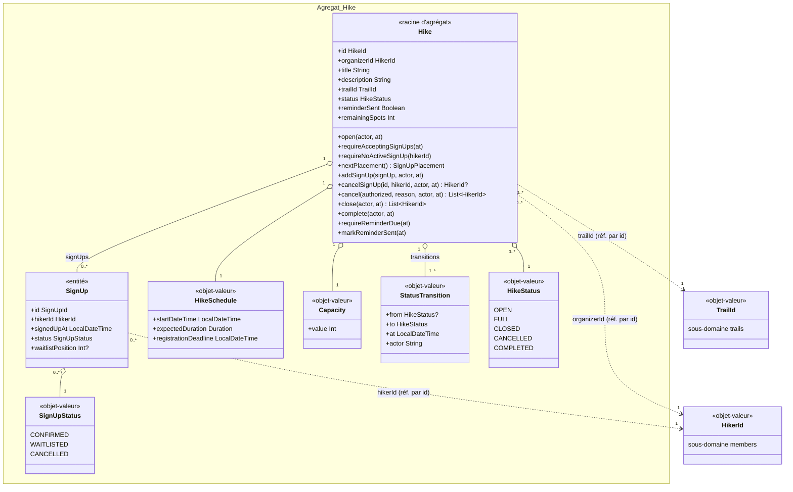
```mermaid
classDiagram
direction TB
namespace Agregat_Hike {
class Hike {
  <<racine d'agrégat>>
  +id HikeId
  +organizerId HikerId
  +title String
  +description String
  +trailId TrailId
  +status HikeStatus
  +reminderSent Boolean
  +remainingSpots Int
  +open(actor, at)
  +requireAcceptingSignUps(at)
  +requireNoActiveSignUp(hikerId)
  +nextPlacement() SignUpPlacement
  +addSignUp(signUp, actor, at)
  +cancelSignUp(id, hikerId, actor, at) HikerId?
  +cancel(authorized, reason, actor, at) List~HikerId~
  +close(actor, at) List~HikerId~
  +complete(actor, at)
  +requireReminderDue(at)
  +markReminderSent(at)
}
class SignUp {
  <<entité>>
  +id SignUpId
  +hikerId HikerId
  +signedUpAt LocalDateTime
  +status SignUpStatus
  +waitlistPosition Int?
}
class HikeSchedule {
  <<objet-valeur>>
  +startDateTime LocalDateTime
  +expectedDuration Duration
  +registrationDeadline LocalDateTime
}
class Capacity {
  <<objet-valeur>>
  +value Int
}
class StatusTransition {
  <<objet-valeur>>
  +from HikeStatus?
  +to HikeStatus
  +at LocalDateTime
  +actor String
}
class HikeStatus {
  <<objet-valeur>>
  OPEN
  FULL
  CLOSED
  CANCELLED
  COMPLETED
}
class SignUpStatus {
  <<objet-valeur>>
  CONFIRMED
  WAITLISTED
  CANCELLED
}
}
class HikerId {
  <<objet-valeur>>
  sous-domaine members
}
class TrailId {
  <<objet-valeur>>
  sous-domaine trails
}
Hike "1" o-- "0..*" SignUp : signUps
Hike "1" o-- "1" HikeSchedule
Hike "1" o-- "1" Capacity
Hike "1" o-- "1..*" StatusTransition : transitions
Hike "0..*" o-- "1" HikeStatus
SignUp "0..*" o-- "1" SignUpStatus
Hike "0..*" ..> "1" HikerId : organizerId (réf. par id)
Hike "0..*" ..> "1" TrailId : trailId (réf. par id)
SignUp "0..*" ..> "1" HikerId : hikerId (réf. par id)
```

*Figure 1. Gestion des randonnées et des inscriptions. HikeId et SignUpId sont des objets-valeurs portés par les attributs id.*

## 5.2 Randonneurs et organisateurs

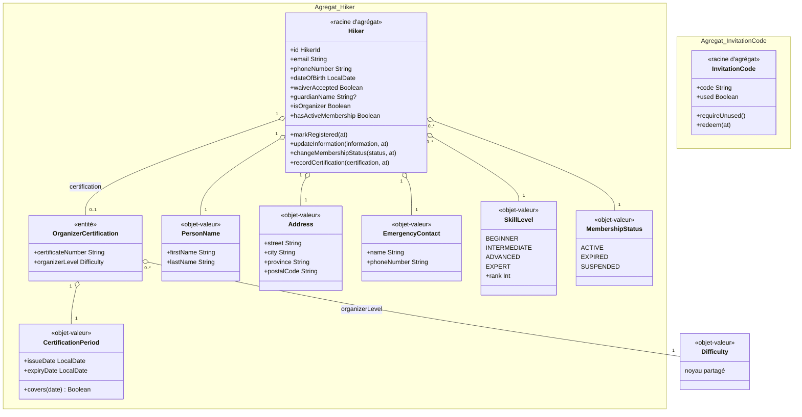
```mermaid
classDiagram
direction TB
namespace Agregat_Hiker {
class Hiker {
  <<racine d'agrégat>>
  +id HikerId
  +email String
  +phoneNumber String
  +dateOfBirth LocalDate
  +waiverAccepted Boolean
  +guardianName String?
  +isOrganizer Boolean
  +hasActiveMembership Boolean
  +markRegistered(at)
  +updateInformation(information, at)
  +changeMembershipStatus(status, at)
  +recordCertification(certification, at)
}
class OrganizerCertification {
  <<entité>>
  +certificateNumber String
  +organizerLevel Difficulty
}
class CertificationPeriod {
  <<objet-valeur>>
  +issueDate LocalDate
  +expiryDate LocalDate
  +covers(date) Boolean
}
class PersonName {
  <<objet-valeur>>
  +firstName String
  +lastName String
}
class Address {
  <<objet-valeur>>
  +street String
  +city String
  +province String
  +postalCode String
}
class EmergencyContact {
  <<objet-valeur>>
  +name String
  +phoneNumber String
}
class SkillLevel {
  <<objet-valeur>>
  BEGINNER
  INTERMEDIATE
  ADVANCED
  EXPERT
  +rank Int
}
class MembershipStatus {
  <<objet-valeur>>
  ACTIVE
  EXPIRED
  SUSPENDED
}
}
namespace Agregat_InvitationCode {
class InvitationCode {
  <<racine d'agrégat>>
  +code String
  +used Boolean
  +requireUnused()
  +redeem(at)
}
}
class Difficulty {
  <<objet-valeur>>
  noyau partagé
}
Hiker "1" o-- "1" PersonName
Hiker "1" o-- "1" Address
Hiker "1" o-- "1" EmergencyContact
Hiker "0..*" o-- "1" SkillLevel
Hiker "0..*" o-- "1" MembershipStatus
Hiker "1" o-- "0..1" OrganizerCertification : certification
OrganizerCertification "1" o-- "1" CertificationPeriod
OrganizerCertification "0..*" o-- "1" Difficulty : organizerLevel
```

*Figure 2. Gestion des randonneurs et des organisateurs. HikerId est un objet-valeur porté par l’attribut id.*

## 5.3 Sentiers

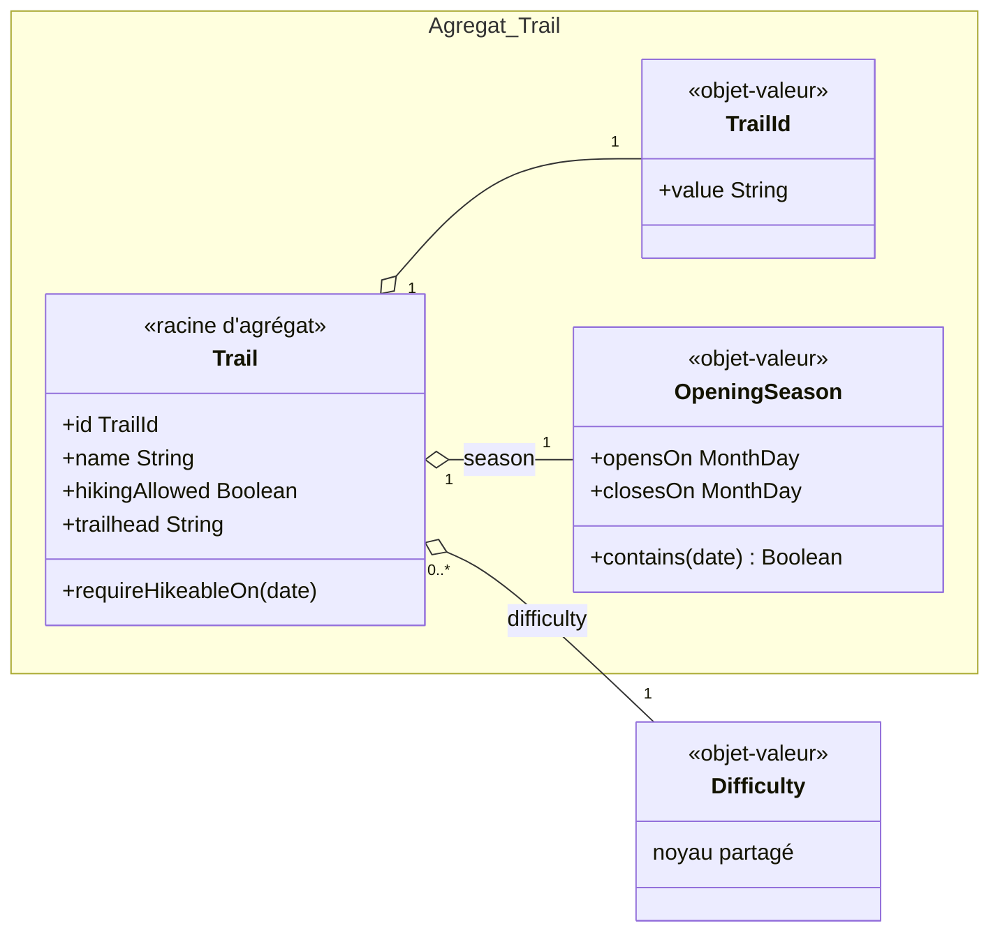
```mermaid
classDiagram
direction LR
namespace Agregat_Trail {
class Trail {
  <<racine d'agrégat>>
  +id TrailId
  +name String
  +hikingAllowed Boolean
  +trailhead String
  +requireHikeableOn(date)
}
class TrailId {
  <<objet-valeur>>
  +value String
}
class OpeningSeason {
  <<objet-valeur>>
  +opensOn MonthDay
  +closesOn MonthDay
  +contains(date) Boolean
}
}
class Difficulty {
  <<objet-valeur>>
  noyau partagé
}
Trail "1" o-- "1" TrailId
Trail "1" o-- "1" OpeningSeason : season
Trail "0..*" o-- "1" Difficulty : difficulty
```

*Figure 3. Informations sur les sentiers.*

## 5.4 Authentification

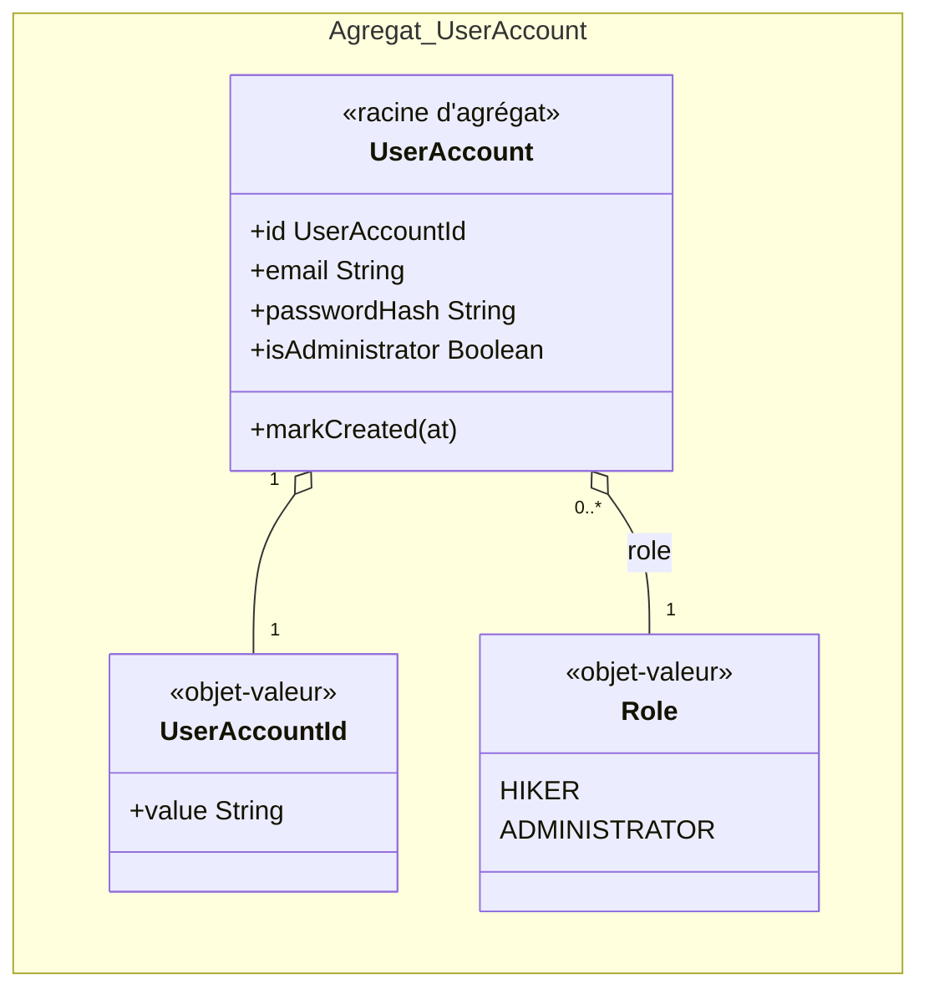
```mermaid
classDiagram
direction LR
namespace Agregat_UserAccount {
class UserAccount {
  <<racine d'agrégat>>
  +id UserAccountId
  +email String
  +passwordHash String
  +isAdministrator Boolean
  +markCreated(at)
}
class UserAccountId {
  <<objet-valeur>>
  +value String
}
class Role {
  <<objet-valeur>>
  HIKER
  ADMINISTRATOR
}
}
UserAccount "1" o-- "1" UserAccountId
UserAccount "0..*" o-- "1" Role : role
```

*Figure 4. Authentification et autorisation.*

## 5.5 Notifications

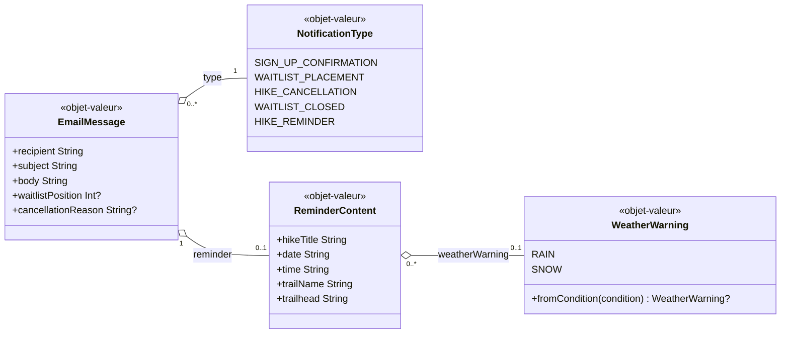
```mermaid
classDiagram
direction LR
class EmailMessage {
  <<objet-valeur>>
  +recipient String
  +subject String
  +body String
  +waitlistPosition Int?
  +cancellationReason String?
}
class NotificationType {
  <<objet-valeur>>
  SIGN_UP_CONFIRMATION
  WAITLIST_PLACEMENT
  HIKE_CANCELLATION
  WAITLIST_CLOSED
  HIKE_REMINDER
}
class ReminderContent {
  <<objet-valeur>>
  +hikeTitle String
  +date String
  +time String
  +trailName String
  +trailhead String
}
class WeatherWarning {
  <<objet-valeur>>
  RAIN
  SNOW
  +fromCondition(condition) WeatherWarning?
}
EmailMessage "0..*" o-- "1" NotificationType : type
EmailMessage "1" o-- "0..1" ReminderContent : reminder
ReminderContent "0..*" o-- "0..1" WeatherWarning : weatherWarning
```

*Figure 5. Notifications et rappels.*

## 5.6 Rapports

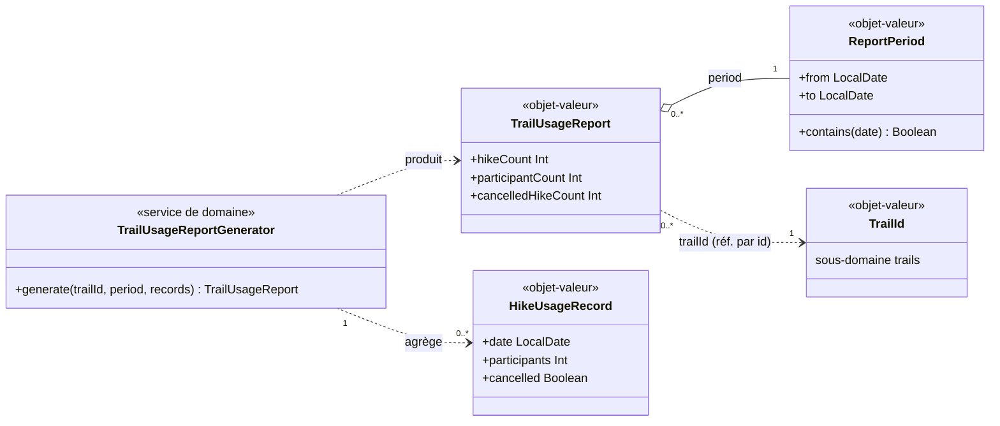
```mermaid
classDiagram
direction LR
class TrailUsageReport {
  <<objet-valeur>>
  +hikeCount Int
  +participantCount Int
  +cancelledHikeCount Int
}
class ReportPeriod {
  <<objet-valeur>>
  +from LocalDate
  +to LocalDate
  +contains(date) Boolean
}
class HikeUsageRecord {
  <<objet-valeur>>
  +date LocalDate
  +participants Int
  +cancelled Boolean
}
class TrailUsageReportGenerator {
  <<service de domaine>>
  +generate(trailId, period, records) TrailUsageReport
}
class TrailId {
  <<objet-valeur>>
  sous-domaine trails
}
TrailUsageReport "0..*" o-- "1" ReportPeriod : period
TrailUsageReport "0..*" ..> "1" TrailId : trailId (réf. par id)
TrailUsageReportGenerator "1" ..> "0..*" HikeUsageRecord : agrège
TrailUsageReportGenerator ..> TrailUsageReport : produit
```

*Figure 6. Rapports d’utilisation des sentiers.*

## 6. Réalisations de cas d’utilisation

Les diagrammes de niveau 1 présentent les interactions entre le cas d’utilisation et les façades ; ceux de niveau 2 détaillent les collaborations avec les fabriques, dépôts, agrégats et événements de domaine. Conformément aux consignes, les cas *Se connecter*, *Se déconnecter* et *Générer le rapport d’utilisation des sentiers* ne figurent pas ici.

## 6.1 Inscrire un randonneur (registerHiker)

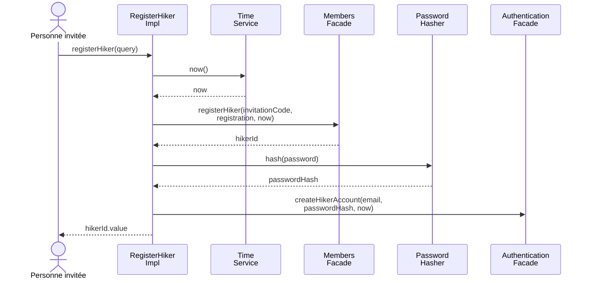
```mermaid
sequenceDiagram
actor V as Personne invitée
participant UC as RegisterHiker<br/>Impl
participant T as Time<br/>Service
participant M as Members<br/>Facade
participant P as Password<br/>Hasher
participant A as Authentication<br/>Facade
V->>UC: registerHiker(query)
UC->>T: now()
T-->>UC: now
UC->>M: registerHiker(invitationCode,<br/>registration, now)
M-->>UC: hikerId
UC->>P: hash(password)
P-->>UC: passwordHash
UC->>A: createHikerAccount(email,<br/>passwordHash, now)
UC-->>V: hikerId.value
```

*Figure 7. registerHiker, niveau 1.*

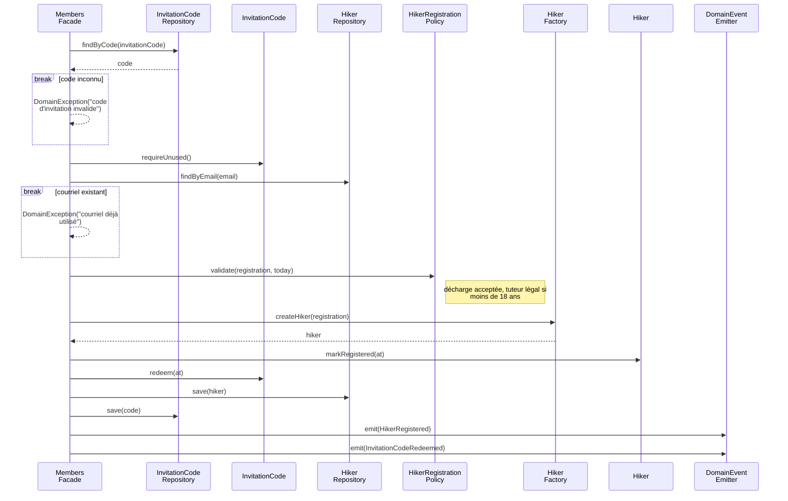
```mermaid
sequenceDiagram
participant M as Members<br/>Facade
participant CR as InvitationCode<br/>Repository
participant C as InvitationCode
participant HR as Hiker<br/>Repository
participant PO as HikerRegistration<br/>Policy
participant F as Hiker<br/>Factory
participant H as Hiker
participant E as DomainEvent<br/>Emitter
M->>CR: findByCode(invitationCode)
CR-->>M: code
break code inconnu
  M-->>M: DomainException("code<br/>d'invitation invalide")
end
M->>C: requireUnused()
M->>HR: findByEmail(email)
break courriel existant
  M-->>M: DomainException("courriel déjà<br/>utilisé")
end
M->>PO: validate(registration, today)
Note right of PO: décharge acceptée, tuteur légal si<br/>moins de 18 ans
M->>F: createHiker(registration)
F-->>M: hiker
M->>H: markRegistered(at)
M->>C: redeem(at)
M->>HR: save(hiker)
M->>CR: save(code)
M->>E: emit(HikerRegistered)
M->>E: emit(InvitationCodeRedeemed)
```

*Figure 8. registerHiker, niveau 2 : MembersFacade.registerHiker.*

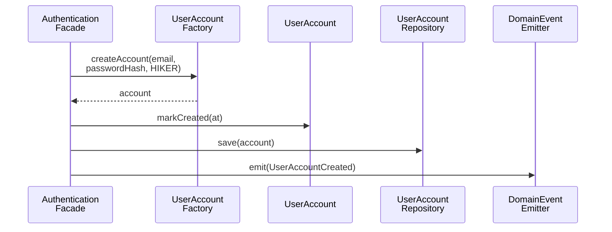
```mermaid
sequenceDiagram
participant A as Authentication<br/>Facade
participant F as UserAccount<br/>Factory
participant U as UserAccount
participant R as UserAccount<br/>Repository
participant E as DomainEvent<br/>Emitter
A->>F: createAccount(email,<br/>passwordHash, HIKER)
F-->>A: account
A->>U: markCreated(at)
A->>R: save(account)
A->>E: emit(UserAccountCreated)
```

*Figure 9. registerHiker, niveau 2 : AuthenticationFacade.createHikerAccount.*

## 6.2 Modifier ses informations (updateHikerInformation)

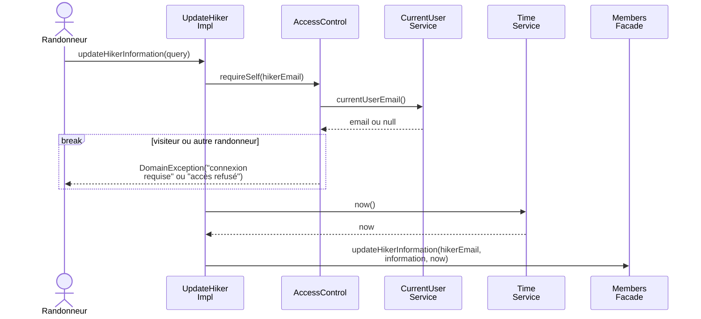
```mermaid
sequenceDiagram
actor V as Randonneur
participant UC as UpdateHiker<br/>Impl
participant AC as AccessControl
participant CU as CurrentUser<br/>Service
participant T as Time<br/>Service
participant M as Members<br/>Facade
V->>UC: updateHikerInformation(query)
UC->>AC: requireSelf(hikerEmail)
AC->>CU: currentUserEmail()
CU-->>AC: email ou null
break visiteur ou autre randonneur
  AC-->>V: DomainException("connexion<br/>requise" ou "accès refusé")
end
UC->>T: now()
T-->>UC: now
UC->>M: updateHikerInformation(hikerEmail,<br/>information, now)
```

*Figure 10. updateHikerInformation, niveau 1.*

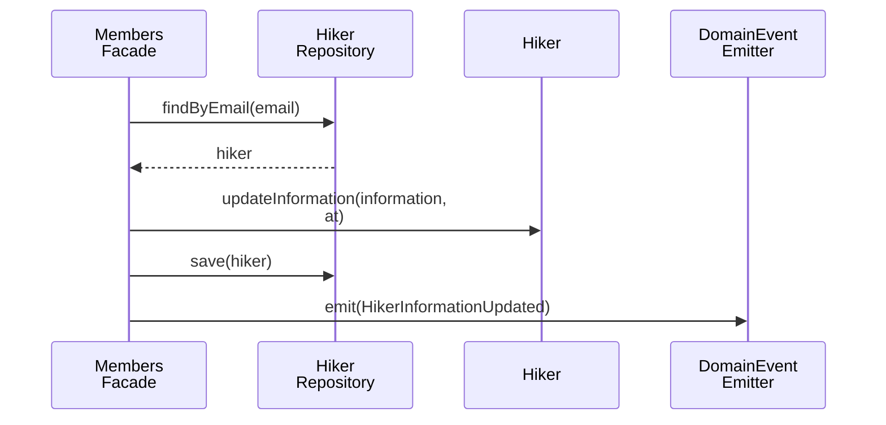
```mermaid
sequenceDiagram
participant M as Members<br/>Facade
participant R as Hiker<br/>Repository
participant H as Hiker
participant E as DomainEvent<br/>Emitter
M->>R: findByEmail(email)
R-->>M: hiker
M->>H: updateInformation(information,<br/>at)
M->>R: save(hiker)
M->>E: emit(HikerInformationUpdated)
```

*Figure 11. updateHikerInformation, niveau 2 : MembersFacade.updateHikerInformation.*

## 6.3 Changer le statut d’adhésion (updateMembershipStatus)

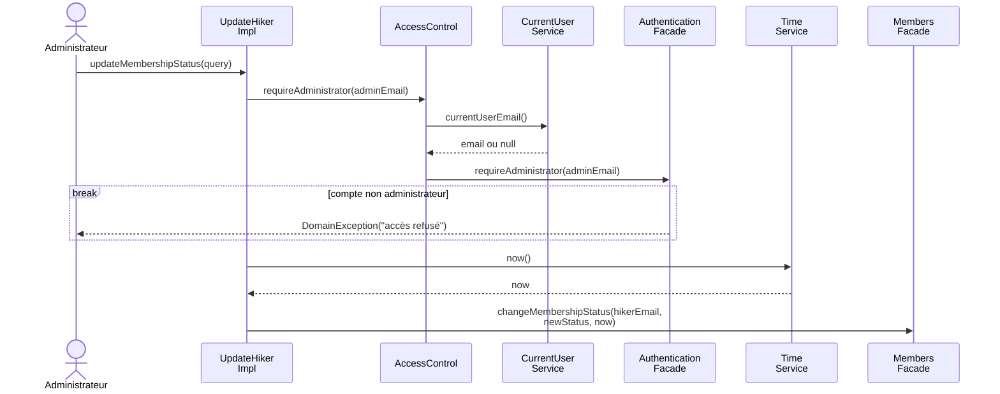
```mermaid
sequenceDiagram
actor V as Administrateur
participant UC as UpdateHiker<br/>Impl
participant AC as AccessControl
participant CU as CurrentUser<br/>Service
participant A as Authentication<br/>Facade
participant T as Time<br/>Service
participant M as Members<br/>Facade
V->>UC: updateMembershipStatus(query)
UC->>AC: requireAdministrator(adminEmail)
AC->>CU: currentUserEmail()
CU-->>AC: email ou null
AC->>A: requireAdministrator(adminEmail)
break compte non administrateur
  A-->>V: DomainException("accès refusé")
end
UC->>T: now()
T-->>UC: now
UC->>M: changeMembershipStatus(hikerEmail,<br/>newStatus, now)
```

*Figure 12. updateMembershipStatus, niveau 1.*

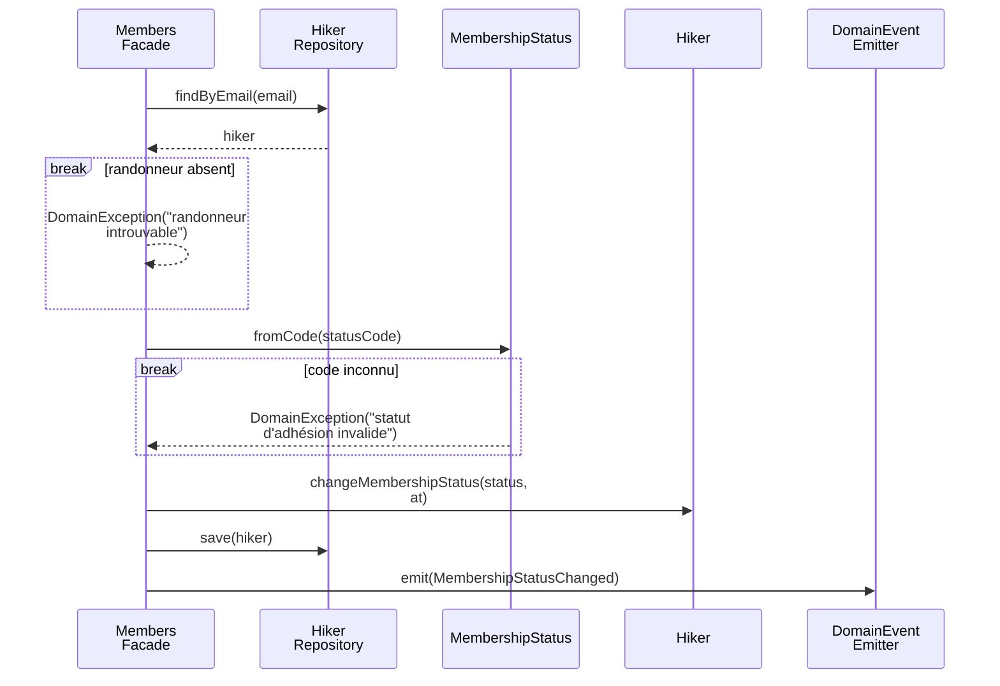
```mermaid
sequenceDiagram
participant M as Members<br/>Facade
participant R as Hiker<br/>Repository
participant S as MembershipStatus
participant H as Hiker
participant E as DomainEvent<br/>Emitter
M->>R: findByEmail(email)
R-->>M: hiker
break randonneur absent
  M-->>M: DomainException("randonneur<br/>introuvable")
end
M->>S: fromCode(statusCode)
break code inconnu
  S-->>M: DomainException("statut<br/>d'adhésion invalide")
end
M->>H: changeMembershipStatus(status,<br/>at)
M->>R: save(hiker)
M->>E: emit(MembershipStatusChanged)
```

*Figure 13. updateMembershipStatus, niveau 2 : MembersFacade.changeMembershipStatus.*

## 6.4 Enregistrer une certification (recordOrganizerCertification)

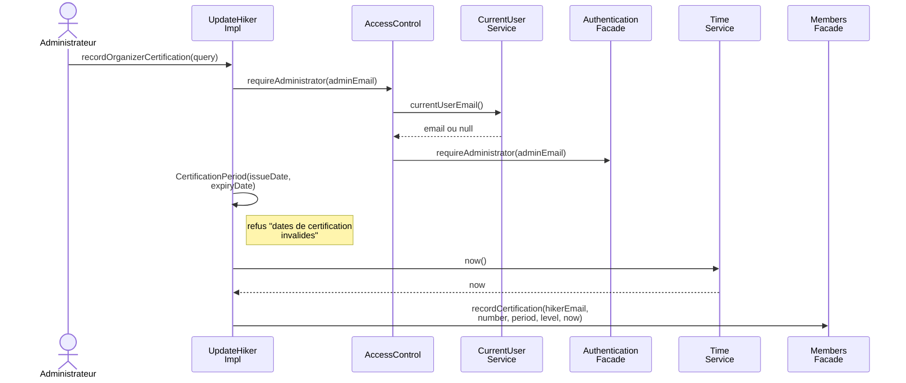
```mermaid
sequenceDiagram
actor V as Administrateur
participant UC as UpdateHiker<br/>Impl
participant AC as AccessControl
participant CU as CurrentUser<br/>Service
participant A as Authentication<br/>Facade
participant T as Time<br/>Service
participant M as Members<br/>Facade
V->>UC: recordOrganizerCertification(query)
UC->>AC: requireAdministrator(adminEmail)
AC->>CU: currentUserEmail()
CU-->>AC: email ou null
AC->>A: requireAdministrator(adminEmail)
UC->>UC: CertificationPeriod(issueDate,<br/>expiryDate)
Note right of UC: refus "dates de certification<br/>invalides"
UC->>T: now()
T-->>UC: now
UC->>M: recordCertification(hikerEmail,<br/>number, period, level, now)
```

*Figure 14. recordOrganizerCertification, niveau 1.*

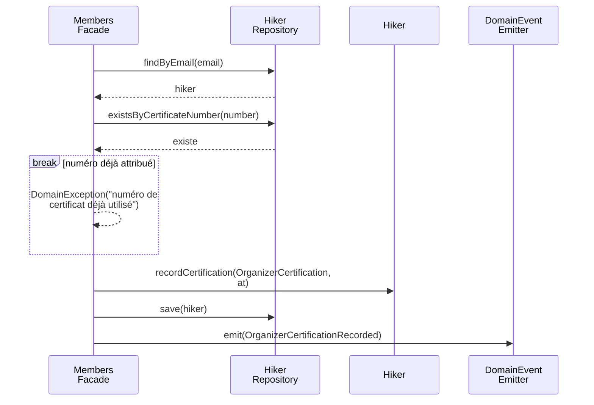
```mermaid
sequenceDiagram
participant M as Members<br/>Facade
participant R as Hiker<br/>Repository
participant H as Hiker
participant E as DomainEvent<br/>Emitter
M->>R: findByEmail(email)
R-->>M: hiker
M->>R: existsByCertificateNumber(number)
R-->>M: existe
break numéro déjà attribué
  M-->>M: DomainException("numéro de<br/>certificat déjà utilisé")
end
M->>H: recordCertification(OrganizerCertification,<br/>at)
M->>R: save(hiker)
M->>E: emit(OrganizerCertificationRecorded)
```

*Figure 15. recordOrganizerCertification, niveau 2 : MembersFacade.recordCertification.*

## 6.5 Créer une randonnée (createHike)

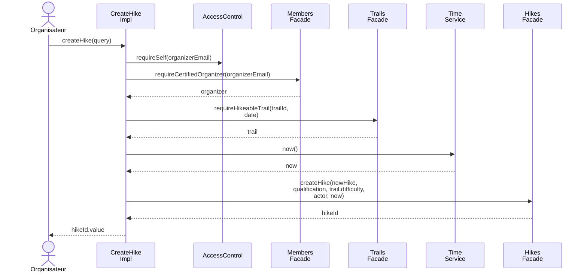
```mermaid
sequenceDiagram
actor V as Organisateur
participant UC as CreateHike<br/>Impl
participant AC as AccessControl
participant M as Members<br/>Facade
participant TR as Trails<br/>Facade
participant T as Time<br/>Service
participant HF as Hikes<br/>Facade
V->>UC: createHike(query)
UC->>AC: requireSelf(organizerEmail)
UC->>M: requireCertifiedOrganizer(organizerEmail)
M-->>UC: organizer
UC->>TR: requireHikeableTrail(trailId,<br/>date)
TR-->>UC: trail
UC->>T: now()
T-->>UC: now
UC->>HF: createHike(newHike,<br/>qualification, trail.difficulty,<br/>actor, now)
HF-->>UC: hikeId
UC-->>V: hikeId.value
```

*Figure 16. createHike, niveau 1.*

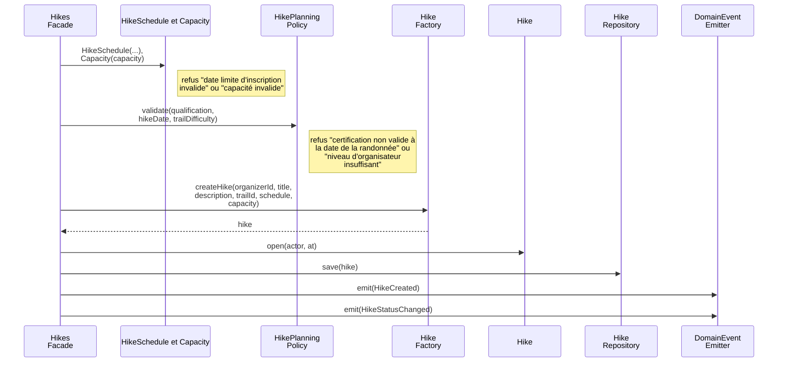
```mermaid
sequenceDiagram
participant HF as Hikes<br/>Facade
participant SV as HikeSchedule et Capacity
participant PO as HikePlanning<br/>Policy
participant F as Hike<br/>Factory
participant H as Hike
participant R as Hike<br/>Repository
participant E as DomainEvent<br/>Emitter
HF->>SV: HikeSchedule(...),<br/>Capacity(capacity)
Note right of SV: refus "date limite d'inscription<br/>invalide" ou "capacité invalide"
HF->>PO: validate(qualification,<br/>hikeDate, trailDifficulty)
Note right of PO: refus "certification non valide à<br/>la date de la randonnée" ou<br/>"niveau d'organisateur<br/>insuffisant"
HF->>F: createHike(organizerId, title,<br/>description, trailId, schedule,<br/>capacity)
F-->>HF: hike
HF->>H: open(actor, at)
HF->>R: save(hike)
HF->>E: emit(HikeCreated)
HF->>E: emit(HikeStatusChanged)
```

*Figure 17. createHike, niveau 2 : HikesFacade.createHike.*

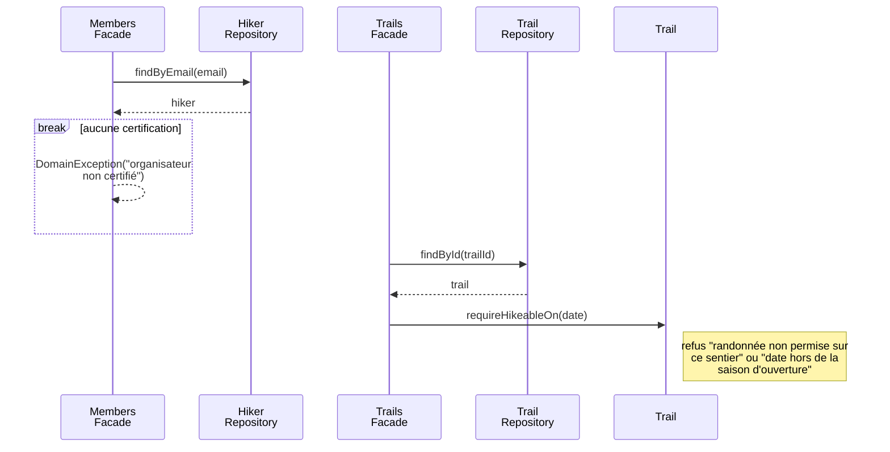
```mermaid
sequenceDiagram
participant M as Members<br/>Facade
participant HR as Hiker<br/>Repository
participant TF as Trails<br/>Facade
participant TRR as Trail<br/>Repository
participant TL as Trail
M->>HR: findByEmail(email)
HR-->>M: hiker
break aucune certification
  M-->>M: DomainException("organisateur<br/>non certifié")
end
TF->>TRR: findById(trailId)
TRR-->>TF: trail
TF->>TL: requireHikeableOn(date)
Note right of TL: refus "randonnée non permise sur<br/>ce sentier" ou "date hors de la<br/>saison d'ouverture"
```

*Figure 18. createHike, niveau 2 : MembersFacade.requireCertifiedOrganizer et TrailsFacade.requireHikeableTrail.*

## 6.6 Annuler une randonnée (cancelHike)

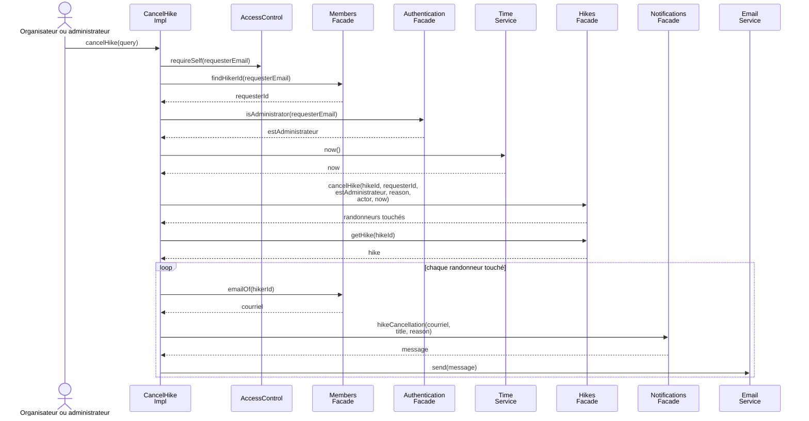
```mermaid
sequenceDiagram
actor V as Organisateur ou administrateur
participant UC as CancelHike<br/>Impl
participant AC as AccessControl
participant M as Members<br/>Facade
participant A as Authentication<br/>Facade
participant T as Time<br/>Service
participant HF as Hikes<br/>Facade
participant N as Notifications<br/>Facade
participant EM as Email<br/>Service
V->>UC: cancelHike(query)
UC->>AC: requireSelf(requesterEmail)
UC->>M: findHikerId(requesterEmail)
M-->>UC: requesterId
UC->>A: isAdministrator(requesterEmail)
A-->>UC: estAdministrateur
UC->>T: now()
T-->>UC: now
UC->>HF: cancelHike(hikeId, requesterId,<br/>estAdministrateur, reason,<br/>actor, now)
HF-->>UC: randonneurs touchés
UC->>HF: getHike(hikeId)
HF-->>UC: hike
loop chaque randonneur touché
  UC->>M: emailOf(hikerId)
  M-->>UC: courriel
  UC->>N: hikeCancellation(courriel,<br/>title, reason)
  N-->>UC: message
  UC->>EM: send(message)
end
```

*Figure 19. cancelHike, niveau 1.*

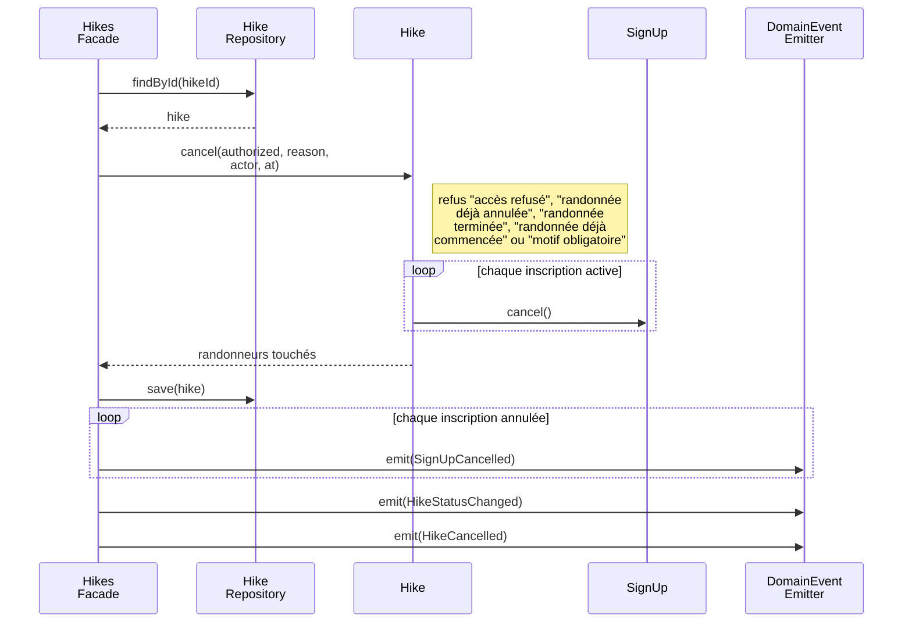
```mermaid
sequenceDiagram
participant HF as Hikes<br/>Facade
participant R as Hike<br/>Repository
participant H as Hike
participant S as SignUp
participant E as DomainEvent<br/>Emitter
HF->>R: findById(hikeId)
R-->>HF: hike
HF->>H: cancel(authorized, reason,<br/>actor, at)
Note right of H: refus "accès refusé", "randonnée<br/>déjà annulée", "randonnée<br/>terminée", "randonnée déjà<br/>commencée" ou "motif obligatoire"
loop chaque inscription active
  H->>S: cancel()
end
H-->>HF: randonneurs touchés
HF->>R: save(hike)
loop chaque inscription annulée
  HF->>E: emit(SignUpCancelled)
end
HF->>E: emit(HikeStatusChanged)
HF->>E: emit(HikeCancelled)
```

*Figure 20. cancelHike, niveau 2 : HikesFacade.cancelHike.*

## 6.7 Fermer une randonnée (closeHike)

```mermaid
sequenceDiagram
actor V as Système
participant UC as CloseHike<br/>Impl
participant T as Time<br/>Service
participant HF as Hikes<br/>Facade
participant M as Members<br/>Facade
participant N as Notifications<br/>Facade
participant EM as Email<br/>Service
V->>UC: closeHike(query)
UC->>T: now()
T-->>UC: now
UC->>HF: closeHike(hikeId, "système",<br/>now)
HF-->>UC: randonneurs retirés
UC->>HF: getHike(hikeId)
HF-->>UC: hike
loop chaque randonneur retiré
  UC->>M: emailOf(hikerId)
  M-->>UC: courriel
  UC->>N: waitlistClosed(courriel, title)
  N-->>UC: message
  UC->>EM: send(message)
end
```

*Figure 21. closeHike, niveau 1.*

```mermaid
sequenceDiagram
participant HF as Hikes<br/>Facade
participant R as Hike<br/>Repository
participant H as Hike
participant S as SignUp
participant E as DomainEvent<br/>Emitter
HF->>R: findById(hikeId)
R-->>HF: hike
HF->>H: close(actor, at)
Note right of H: refus "randonnée ni ouverte ni<br/>complète" ou "date limite non<br/>atteinte"
loop chaque inscription en liste d'attente
  H->>S: cancel()
end
H-->>HF: randonneurs retirés
HF->>R: save(hike)
loop chaque inscription annulée
  HF->>E: emit(SignUpCancelled)
end
HF->>E: emit(HikeStatusChanged)
HF->>E: emit(HikeClosed)
```

*Figure 22. closeHike, niveau 2 : HikesFacade.closeHike.*

## 6.8 Consulter les randonnées ouvertes (browseOpenHikes)

```mermaid
sequenceDiagram
actor V as Visiteur ou randonneur
participant UC as BrowseHikes<br/>Impl
participant HF as Hikes<br/>Facade
participant TR as Trails<br/>Facade
participant M as Members<br/>Facade

V->>UC: browseOpenHikes(query)
UC->>HF: findOpenHikes()
HF-->>UC: randonnées ouvertes triées

loop chaque randonnée
    UC->>TR: getTrail(trailId)
    TR-->>UC: trail
end

UC->>UC: filtrer par sentier, date et<br/>difficulté

loop chaque randonnée retenue
    UC->>M: organizerNameOf(hike.organizerId)
    M-->>UC: organizerName
    UC->>UC: construire HikeSummary
end

UC-->>V: List of HikeSummary
```

*Figure 23. browseOpenHikes, niveau 1.*

```mermaid
sequenceDiagram
participant HF as Hikes<br/>Facade
participant R as Hike<br/>Repository
participant TF as Trails<br/>Facade
participant TRR as Trail<br/>Repository
HF->>R: findByStatus(OPEN)
R-->>HF: hikes
HF->>HF: trier par départ, convertir en<br/>HikeDetails
TF->>TRR: findById(trailId)
TRR-->>TF: trail
Note over HF,TRR: Consultation sans changement<br/>d'état : aucun événement de<br/>domaine
```

*Figure 24. browseOpenHikes, niveau 2 : HikesFacade.findOpenHikes et TrailsFacade.getTrail.*

## 6.9 Lister les randonnées correspondantes (listMatchingHikes)

```mermaid
sequenceDiagram
actor V as Randonneur
participant UC as BrowseHikes<br/>Impl
participant AC as AccessControl
participant M as Members<br/>Facade
participant HF as Hikes<br/>Facade
participant TR as Trails<br/>Facade
V->>UC: listMatchingHikes(query)
UC->>AC: requireSelf(hikerEmail)
UC->>M: getProfile(hikerEmail)
M-->>UC: profile
UC->>HF: findOpenHikes()
HF-->>UC: randonnées ouvertes triées
loop chaque randonnée
  UC->>TR: getTrail(trailId)
  TR-->>UC: trail
  UC->>HF: matchesSkill(skillRank,<br/>trail.difficulty)
  HF-->>UC: correspond
end
loop chaque randonnée retenue
    UC->>M: organizerNameOf(hike.organizerId)
    M-->>UC: organizerName
    UC->>UC: construire HikeSummary
end
UC-->>V: List of HikeSummary
```

*Figure 25. listMatchingHikes, niveau 1.*

```mermaid
sequenceDiagram
participant M as Members<br/>Facade
participant HR as Hiker<br/>Repository
participant HF as Hikes<br/>Facade
participant R as Hike<br/>Repository
participant PO as SkillMatching<br/>Policy
M->>HR: findByEmail(email)
HR-->>M: hiker
HF->>R: findByStatus(OPEN)
R-->>HF: hikes
HF->>PO: matches(skillRank, difficulty)
Note right of PO: rang(difficulté) <= rang(niveau) +<br/>1
PO-->>HF: correspond
Note over M,PO: Consultation sans changement<br/>d'état : aucun événement de<br/>domaine
```

*Figure 26. listMatchingHikes, niveau 2 : MembersFacade.getProfile et HikesFacade.*

## 6.10 S’inscrire à une randonnée (signUpForHike)

```mermaid
sequenceDiagram
actor V as Randonneur
participant UC as SignUpForHike<br/>Impl
participant AC as AccessControl
participant M as Members<br/>Facade
participant HF as Hikes<br/>Facade
participant TR as Trails<br/>Facade
participant T as Time<br/>Service
participant N as Notifications<br/>Facade
participant EM as Email<br/>Service
V->>UC: signUpForHike(query)
UC->>AC: requireSelf(hikerEmail)
UC->>M: requireActiveMember(hikerEmail)
M-->>UC: hiker
UC->>HF: getHike(hikeId)
HF-->>UC: hike
UC->>TR: getTrail(trailId)
TR-->>UC: trail
UC->>T: now()
T-->>UC: now
UC->>HF: signUp(hikeId, hikerId,<br/>skillRank, difficulty, actor,<br/>now)
HF-->>UC: result
alt inscription confirmée
  UC->>N: signUpConfirmation(hikerEmail,<br/>title)
else liste d'attente
  UC->>N: waitlistPlacement(hikerEmail,<br/>title, position)
end
N-->>UC: message
UC->>EM: send(message)
UC-->>V: signUpId.value
```

*Figure 27. signUpForHike, niveau 1.*

```mermaid
sequenceDiagram
participant HF as Hikes<br/>Facade
participant R as Hike<br/>Repository
participant H as Hike
participant PO as SkillMatching<br/>Policy
participant F as SignUp<br/>Factory
participant E as DomainEvent<br/>Emitter
HF->>R: findById(hikeId)
R-->>HF: hike
HF->>H: requireAcceptingSignUps(at)
HF->>PO: matches(skillRank,<br/>trailDifficulty)
PO-->>HF: correspond
break niveau trop faible
  HF-->>HF: DomainException("niveau<br/>d'habileté insuffisant")
end
HF->>H: requireNoActiveSignUp(hikerId)
HF->>H: nextPlacement()
H-->>HF: placement
HF->>F: createSignUp(hikerId, placement,<br/>at)
F-->>HF: signUp
HF->>H: addSignUp(signUp, actor, at)
HF->>R: save(hike)
alt place confirmée
  HF->>E: emit(SignUpConfirmed)
  opt dernière place
    HF->>E: emit(HikeStatusChanged)
  end
else liste d'attente
  HF->>E: emit(SignUpWaitlisted)
end
```

*Figure 28. signUpForHike, niveau 2 : HikesFacade.signUp.*

## 6.11 Annuler une inscription (cancelSignUp)

```mermaid
sequenceDiagram
actor V as Randonneur
participant UC as CancelSignUp<br/>Impl
participant AC as AccessControl
participant M as Members<br/>Facade
participant T as Time<br/>Service
participant HF as Hikes<br/>Facade
participant N as Notifications<br/>Facade
participant EM as Email<br/>Service
V->>UC: cancelSignUp(query)
UC->>AC: requireSelf(hikerEmail)
UC->>M: getProfile(hikerEmail)
M-->>UC: hiker
UC->>T: now()
T-->>UC: now
UC->>HF: cancelSignUp(signUpId, hikerId,<br/>actor, now)
HF-->>UC: randonneur promu ou null
opt un randonneur est promu
  UC->>HF: getHikeOfSignUp(signUpId)
  HF-->>UC: hike
  UC->>M: emailOf(promotedId)
  M-->>UC: courriel
  UC->>N: signUpConfirmation(courriel,<br/>title)
  N-->>UC: message
  UC->>EM: send(message)
end
```

*Figure 29. cancelSignUp, niveau 1.*

```mermaid
sequenceDiagram
participant HF as Hikes<br/>Facade
participant R as Hike<br/>Repository
participant H as Hike
participant S as SignUp
participant E as DomainEvent<br/>Emitter
HF->>R: findBySignUpId(signUpId)
R-->>HF: hike
HF->>H: cancelSignUp(signUpId, hikerId,<br/>actor, at)
Note right of H: refus "accès refusé", "inscription<br/>non active" ou "date limite<br/>dépassée"
H->>S: cancel()
opt place confirmée libérée et liste d'attente non vide
  H->>S: confirm() sur le premier en<br/>attente
end
H->>S: moveToPosition(position) sur les<br/>suivants
H-->>HF: randonneur promu ou null
HF->>R: save(hike)
HF->>E: emit(SignUpCancelled)
opt promotion
  HF->>E: emit(SignUpPromoted)
end
opt position modifiée
  HF->>E: emit(WaitlistPositionChanged)
end
opt complète sans liste d'attente
  HF->>E: emit(HikeStatusChanged)
end
```

*Figure 30. cancelSignUp, niveau 2 : HikesFacade.cancelSignUp.*

## 6.12 Envoyer le rappel (sendHikeReminder)

```mermaid
sequenceDiagram
actor V as Système
participant UC as SendHikeReminder<br/>Impl
participant T as Time<br/>Service
participant HF as Hikes<br/>Facade
participant TR as Trails<br/>Facade
participant W as Weather<br/>Service
participant M as Members<br/>Facade
participant N as Notifications<br/>Facade
participant EM as Email<br/>Service
V->>UC: sendHikeReminder(query)
UC->>T: now()
T-->>UC: now
UC->>HF: prepareReminder(hikeId, now)
HF-->>UC: hike
UC->>TR: getTrail(trailId)
TR-->>UC: trail
UC->>W: forecast(trail.trailhead, hike.startDateTime.toLocalDate())
alt service disponible
  W-->>UC: condition
else service indisponible
  W-->>UC: WeatherServiceUnavailableException,<br/>condition = null
end
loop chaque participant confirmé
  UC->>M: emailOf(hikerId)
  M-->>UC: courriel
  UC->>N: hikeReminder(courriel, title,<br/>start, trail, trailhead,<br/>condition)
  N-->>UC: message
  UC->>EM: send(message)
end
UC->>HF: markReminderSent(hikeId, now)
```

*Figure 31. sendHikeReminder, niveau 1.*

```mermaid
sequenceDiagram
participant HF as Hikes<br/>Facade
participant R as Hike<br/>Repository
participant H as Hike
participant E as DomainEvent<br/>Emitter
HF->>R: findById(hikeId)
R-->>HF: hike
HF->>H: requireReminderDue(at)
Note right of H: refus "randonnée annulée", "rappel<br/>déjà envoyé" ou "départ pas dans<br/>24 heures"
H-->>HF: rappel dû
Note over HF,E: Après l'envoi des courriels :<br/>markReminderSent(hikeId, at)
HF->>R: findById(hikeId)
R-->>HF: hike
HF->>H: markReminderSent(at)
HF->>R: save(hike)
HF->>E: emit(HikeReminderSent)
```

*Figure 32. sendHikeReminder, niveau 2 : HikesFacade.prepareReminder et markReminderSent.*

## 7. Déclaration d’utilisation de l’IA générative

| Outil (version) | Utilisation | Vérification |
|---|---|---|
| ChatGPT (GPT-6, OpenAI) | Assistance pour la correction du code Kotlin, l’ajout et l’ajustement de tests, ainsi que la mise en forme et la simplification du document Markdown. | Relecture des modifications et exécution locale de `gradlew.bat clean test` : `BUILD SUCCESSFUL` (84 tests réussis). |

**Conception sans IA générative :** les modèles du domaine, les décisions de conception et les diagrammes de réalisation des cas d’utilisation ont été réalisés sans recours à l’IA générative.

## 8. Références

1. SEG 3502, *Livrable 2 : Domaine*, automne 2026, Université d’Ottawa.
2. CAR-HMS, *Exigences initiales*, document fourni pour le projet.
3. [Documentation Cucumber](https://cucumber.io/docs).
4. [Documentation Mermaid](https://mermaid.js.org).
